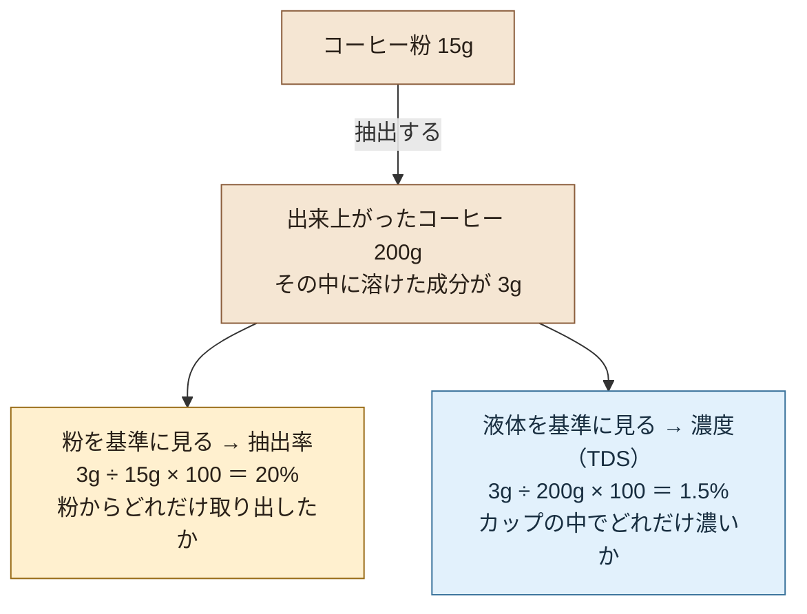
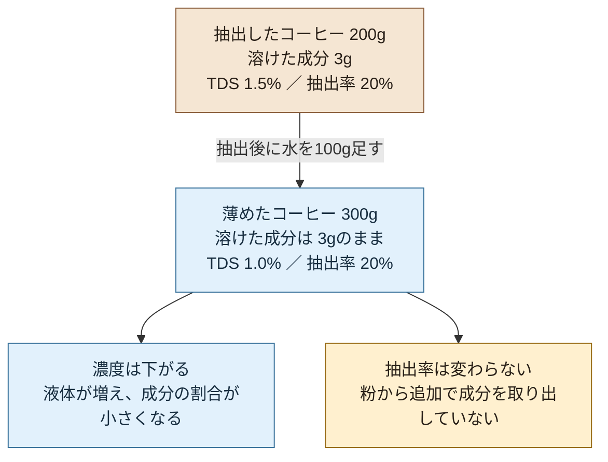

# 抽出の原則

## 核心となる考え
抽出とは、好ましい成分を溶かし出しながら、好ましくない成分を残すバランスのコントロールである。

## 客観的な事実
- **溶けやすさの違い**：成分ごとに溶け出しやすさや速度が異なり、複数の成分が重なって抽出される。苦味成分にも早く出るものと遅く出るものがある。「酸味→甘味→苦味」の順番に入れ替わるわけではない（[苦味成分の抽出研究](https://pubmed.ncbi.nlm.nih.gov/20180507/)）
- **挽き目（粒の大きさ）の影響**：細かく挽くほど豆の表面積が増え、成分が溶け出す速度が上がる（＝抽出が進みやすくなる）
- **お湯の温度と時間の影響**：ほかの条件が同じなら、温度を高くしたり時間を長くしたりすると抽出が進みやすい。ただし、TDSは成分の「総量」ではなく、液体中の成分の「割合」。抽出液の量も変わる場合、抽出が進んでもTDSが上がるとは限らない

## 図で理解する：濃度（TDS）と抽出率

**コーヒーでは、TDS（%）は濃度を数値で表したもの。別々の性質ではない。**

まず、「粉からどれだけ取り出したか」と「カップの中でどれだけ濃いか」を分けて考える。

**同じ「成分3g」でも、何を基準にするかで意味が変わる。** ここでの抽出率は、カップに回収した成分量から求める一般的な計算値。

「濃度」は、液体に成分がどれくらいの割合で溶けているかという考え方。TDSは *Total Dissolved Solids*（総溶解固形分）の略で、コーヒーでは濃度を質量の割合（%）で表す。

> TDS（%）＝溶けている成分の質量 ÷ 抽出液全体の質量 × 100

例えば、200gのコーヒーに成分が3g溶けていれば、TDSは **1.5%**。この200gには、溶けた成分3gも含まれる。

### 「成分の量」「濃度」「感じる濃さ」を分ける

| 言葉 | 何を表すか | 上の例では |
| --- | --- | --- |
| 溶けた成分の量 | 液体に含まれる成分の質量 | 3g |
| 濃度（TDS） | 液体全体に対する成分の割合 | 1.5% |
| 飲んだときの濃さ | 味の強さや口当たりなどを含む感覚 | TDSだけでは決まらない |

同じTDSでも、成分の内訳によって苦味や酸味の強さ、口当たりは変わる。**TDSは「どのくらい溶けているか」の指標であり、「おいしさ」や「苦さ」そのものの数値ではない。**

### 水を足すと分かりやすい

上のコーヒー200gに水を100g足すと、液体は300gになる。足す水の溶解成分を無視すると、コーヒー由来の成分は3gのままなので、TDSは **1.0%** に下がる。

- 水を足す前：3g ÷ 200g × 100 ＝ **1.5%**
- 水を足した後：3g ÷ 300g × 100 ＝ **1.0%**

成分の量が同じでも、水が増えると濃度は下がる。「総量」と「濃度」はここが違う。

### 同じ濃度でも抽出率は違う

二つのコーヒーに、同じ濃度でも抽出率が違う例を考える。

|  | コーヒーA | コーヒーB |
| --- | --- | --- |
| 使った粉 | 15g | 20g |
| 出来上がった液体 | 200g | 200g |
| カップに取り出した成分 | 3g | 3g |
| 濃度（成分 ÷ 液体） | 3 ÷ 200 × 100＝1.5% | 3 ÷ 200 × 100＝1.5% |
| 抽出率（成分 ÷ 粉） | 3 ÷ 15 × 100＝20% | 3 ÷ 20 × 100＝15% |

同じ3gの成分でも、少ない粉から取り出したのか、多い粉から取り出したのかで抽出率は違う。**濃度の基準は液体、抽出率の基準は粉。** ここでも、抽出率はカップに回収した成分量から求めている。

抽出率が表すのは取り出した量の割合で、成分の内訳ではない。抽出条件によって成分の比率も変わりうるため、同じ抽出率でも同じ味になるとは限らない。

### この違いは、いつ使う？

**飲んだ感想から、次に何を調整するかを考えるときに使う。**

例えば「味のバランスは好きだけれど、濃すぎる」なら、抽出後にお湯を少し足し、濃度を下げてみる。一方、「酸味が尖って物足りない」なら抽出不足の可能性もあるので、粉と湯量を固定し、挽き目を少し細かくするなど、抽出のしかたを一つ変えて確かめる。味だけで原因は断定しない。

上の図で水を足したコーヒーは薄くなるが、抽出不足になったわけではない。**「薄い＝抽出不足」「濃い＝抽出しすぎ」と決めつけないことが、この区別の使いどころ。**

体感するなら、同じコーヒーを二つに分け、片方だけ少量のお湯を足して飲み比べる。抽出のしかたが同じでも、濃度だけで印象がどう変わるかを確かめられる。

参考：[Barista Hustle — TDSと抽出率の定義](https://www.baristahustle.com/vst-wtf-part-3/)

## 主観的な感じ方

以下は味を振り返る手がかり。味だけで抽出不足・過多を断定することはできず、濃度・豆・焙煎などの影響も考える。

- **抽出不足のとき**：酸っぱい・塩っぽい・薄い・余韻がない
- **抽出過多のとき**：苦い・渋い・乾いた感じ・空洞感がある
- **ちょうどよいとき**：甘い・バランスが取れている・複雑味がある

## 今日の名言
> 「抽出とは全てを出すことではなく、正しい成分を正しい比率で取り出すことである。」

## 自分との接続

### 自分の言葉で言うと
> （抽出について、自分なりに一言でまとめてみよう）

### 実際に体験したこと

> 僕も経験から熱い温度でコーヒーを入れたり、粉の挽目を細かくしたら苦くなると覚えているのでなんでだろうと思っていました。

経験から考えた仮説・確かめ方・練習問題は、[高温・細挽きで苦く感じるとき](../03_patterns/bitterness_temperature_grind.md)に整理した。

### まだ腑に落ちていないこと
- （疑問・違和感・次に試してみたいこと）
